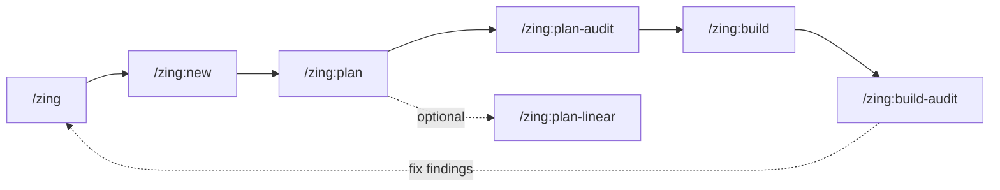
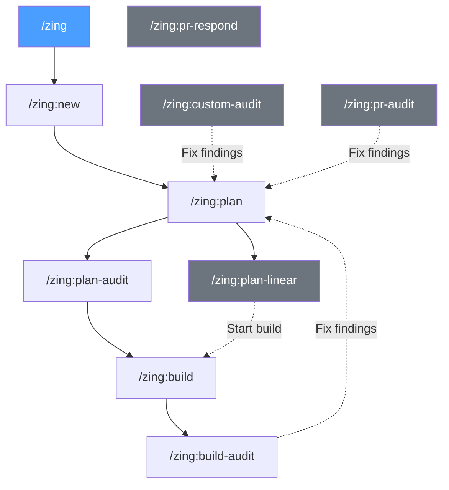
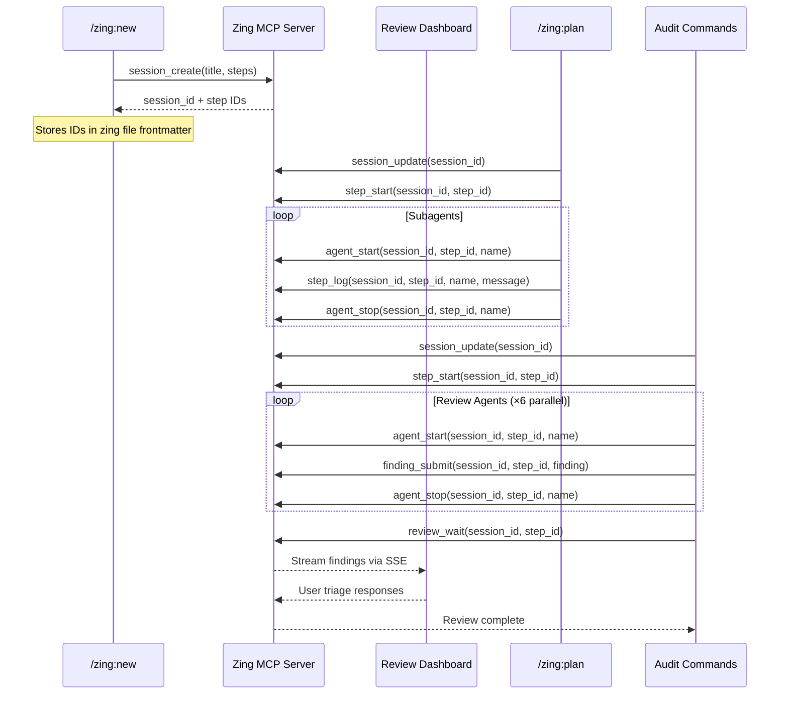
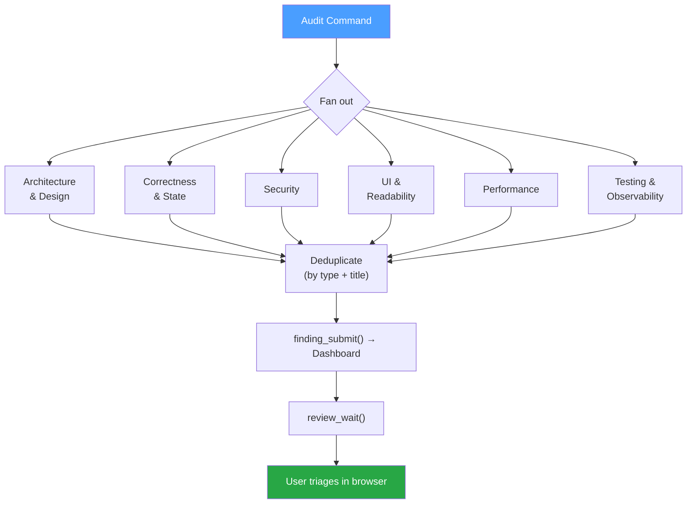
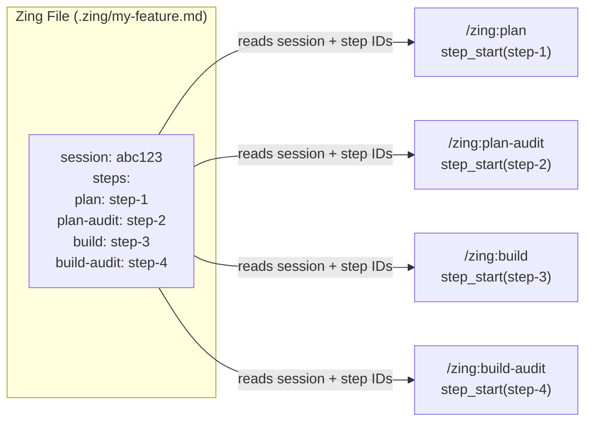

# Zing!


<br /><br /><br />

> Zing plans, builds, tests, and ships clean code with AI.<br/>
> Zing keeps you in charge at each step.<br/>
> This is the Zen of Zing.

---

## The Problem

AI is good at a lot of things. Reducing entropy isn't one of them.

Every AI-generated line of code is a small bet. Sometimes it's exactly right. Often it's close enough. But over hundreds and thousands of those bets, the misses accumulate. Variable names drift. Abstractions get duplicated. Edge cases get papered over. The codebase collapses because it decays.

AI coding assistants are great at writing functions. But shipping software isn't just writing functions. It's understanding what to build, figuring out where it fits in the codebase, breaking work into steps that make sense, building it incrementally, reviewing it properly, and tracking it in your project management tool. Today, you do all of that orchestration yourself, or you don't, and entropy wins.

## Why Zing is Different

### It's an entropy reduction engine.
Zing gives you the tools to stay in control. You make the big decisions: what to build, which approach to take, which trade-offs to accept. The AI handles the smaller implementation decisions within the boundaries you set. This is the opposite of vibe coding. It's structured coding with AI as the executor, not the architect.

### The review loop.
Code review isn't just a gate at the end. It's how the system self-improves. Four specialized review agents catch inconsistencies, flag drift from the plan, and surface entropy before it gets committed. Every review pass actively removes disorder from the system. The result is a codebase that gets cleaner over time, not messier, even though AI is writing most of the code, because humans are involved in every step of the process.

### It's a pipeline, not a prompt.
Each stage feeds into the next. The plan audit catches problems before they're built. The build follows the audited plan exactly. The code review knows what was intended because it has the spec. Entropy can't sneak in between the cracks when there are no cracks.

### Parallelism is a first-class concept.
Codebase exploration, plan evaluation, and code review all fan out across multiple specialized agents working simultaneously. This isn't just faster. It produces better results because each agent has a focused lens.

### A real-time review dashboard.
Zing includes a built-in MCP server and web UI. When review agents run, they stream findings to a live dashboard in your browser via Server-Sent Events. You see agents spin up, watch findings arrive in real time, and triage them without leaving the browser — accept, drop, downgrade, or discuss each finding, pick from suggested approaches, or write your own. Responses auto-save as you go. The MCP server coordinates the whole workflow: agents submit findings through it, and your AI coding assistant blocks until you submit your responses in the browser, then picks up exactly where you left off.

### Humans stay in the loop.
Zing doesn't disappear into a corner and come back with a PR. It checks in at every stage, confirming the spec, walking through plan improvements, discussing review findings one by one. You make the decisions. Zing does the legwork.

### Chain of thought, not chain of hope.
The pipeline structure acts as an external chain of thought. Each stage narrows the problem space before the next one starts. The AI never has to hold an entire complex system in its head at once. It specs, then plans, then builds one step at a time. This is how you get reliable output on complex systems.

### It's opinionated about discipline.
The build phase has strict anti-patterns: no deviations from the plan, no bonus features, no drive-by refactoring. Every step has acceptance criteria. Every completion gets a commit. This is how you ship reliably with AI, by keeping it on rails.

## What Zing Does

Zing is a pipeline of specialized AI tools backed by a live review dashboard:

### 1. Capture (`/zing`)
Zing starts with a conversation or a Linear ticket URL. It listens, asks the right questions, and saves a structured spec to your `.zing/` directory. No templates to fill out. Just talk about what you want to build.

### 2. Plan (`/zing-plan`)
Zing explores your codebase in parallel. Multiple agents fan out simultaneously to map relevant files, understand existing patterns, and identify integration points. It asks you targeted questions, then produces a concrete action plan with acceptance criteria for every step.

### 3. Audit the Plan (`/zing-plan-audit`)
Before a single line of code is written, parallel evaluation passes stress-test your plan:

- **Design Fundamentals**: Is this the right approach? Is it overengineered?
- **Robustness & Safety**: Will it break things? Is it testable?
- **Executable Spec**: Is every step specific enough to actually build?
- **Code Quality**: Does it follow the idioms of the codebase?

Each dimension gets a rating, and weak spots come with concrete improvement options.

### 4. Track (`/zing-plan-linear`)
Zing creates a Linear project with tickets for each phase, sequential dependencies between them, and the full plan attached as a document. Your project management stays in sync without you touching it.

### 5. Build (`/zing-build`)
Zing executes the plan step by step. After each step, it commits, updates the progress checklist, and moves on. No scope creep, no unsolicited refactoring, no features that weren't in the plan. Just disciplined, incremental delivery against the spec.

### 6. Review (`/zing-build-audit`)
Four parallel review agents examine your branch's changes like senior developers:

- **Correctness**: Logic errors, edge cases, error handling
- **Security & Reliability**: Vulnerabilities, production readiness
- **Quality & Style**: Naming, readability, idiomatic code
- **Coverage & Performance**: Test gaps, bottleneck risks

Findings stream into a **live review dashboard** in your browser. You can watch agents work in real time — spinners show which agents are running, notification dots flag new findings on each tab, and build logs are available for diagnostics. When agents finish, you triage each finding directly in the browser: accept, drop, downgrade, or discuss. Choose from suggested fix approaches or write your own. Text responses and selections auto-save as you go. When you're ready, hit Submit and Zing picks up where it left off — applying fixes, writing a review report, and moving to the next stage.

### 7. Ship
When the review is clean, Zing offers to open your pull request. Draft by default, because you're still in control.

### 8. PR Respond (`/zing-pr-respond`)
Given a PR link or number, Zing checks out the branch, fetches all unresolved review comments, and walks you through each one. It analyzes whether the comment needs a code fix, a reply, or is already addressed. When there's one clear fix it proposes the change; when there are multiple approaches it asks you to pick. After all comments are handled, it commits and pushes the changes, posts replies on GitHub, and resolves the threads. Then it polls CI with increasing backoff until all checks complete. If any checks fail, Zing investigates the logs, fixes the failures, pushes again, and loops back to check for any new unresolved comments — repeating the full cycle until CI is green. Finally, it re-requests reviews from stale reviewers so the PR is ready for another look.

### 9. PR Review (`/zing-pr-audit`)
Once a PR is open, Zing can review it the way a senior developer would — on GitHub, with line-level comments. It checks out the PR branch, reads every changed file in full, fans out four parallel review agents (the same ones from the build review), and walks you through each finding before submitting. The final review is posted via the GitHub API with inline comments on the exact lines that matter, severity ratings, and code suggestions where the fix is obvious. The review action (approve, comment, or request changes) is your call. A local markdown report is also saved so you can feed findings straight back into `/zing-plan` if fixes are needed.

### 10. Code Audit (`/zing-custom-audit`)
Point Zing at any area of your codebase — files, directories, or just a description like "the authentication module" — and it performs a focused audit. Zing resolves your description to concrete files, confirms the scope with you, then fans out six parallel review agents to analyze the code as it stands today. Each finding is walked through one by one so you can validate, discuss, or dismiss it. Confirmed findings are written to a markdown report you can feed into `/zing-plan` to start fixing them.

---

## Installation

### Prerequisites

- Python >= 3.12
- [uv](https://docs.astral.sh/uv/getting-started/installation/)

### Recommended MCP Servers

Zing works best when your AI coding assistant has the following MCP servers installed and configured:

- **[Serena](https://github.com/oraios/serena)** — Semantic code tools via LSP for token-efficient code exploration and precise symbol-level editing
- **[AI Distiller](https://github.com/janreges/ai-distiller)** — Compact code structure extraction and specialized analysis (security audits, bug hunting, refactoring)
- **[CodeGraphContext](https://github.com/CodeGraphContext/CodeGraphContext)** — Code graph analysis for understanding call chains, detecting dead code, and architectural queries
- **[Context7](https://github.com/upstash/context7)** — Up-to-date library documentation and code examples, so your assistant doesn't rely on stale training data

It also benefits from having the **[GitHub CLI (`gh`)](https://cli.github.com/)** installed for creating pull requests, managing issues, and interacting with GitHub directly from the command line.

These servers give Zing's agents deeper insight into your codebase during planning, building, and reviewing.

### Start the dashboard

Before using any review command, start the Zing server in a separate terminal:

```
zing-ai mcp
```

This launches the MCP server and review dashboard on `http://127.0.0.1:9876`. The dashboard is available at `http://127.0.0.1:9876/dashboard`. Leave this running while you work — review commands won't function without it.

The MCP connection is automatically registered with Claude Code during installation (via `mcp-remote`), so Claude Code will connect to the running server when review tools are invoked.

### Permissions

The review commands use the MCP server and `curl` to coordinate agent workflows. To avoid repeated permission prompts, add the following to your global Claude Code settings (`~/.claude/settings.json`) under `permissions.allow`:

```json
"Bash(curl:*)",
"mcp__zing-ai__*"
```

<!--
### Install from PyPI

```
uv tool install zing-ai
```
-->

### Install from GitHub

**Stable (recommended):**
```
uv tool install git+https://github.com/Farmer-Pete/Zing
```

**Bleeding edge / unstable** (latest features, may have rough edges):
```
uv tool install --force git+https://github.com/Farmer-Pete/Zing@zing-next
```

To switch back to stable:
```
uv tool install --force git+https://github.com/Farmer-Pete/Zing
```

### Set up commands for your AI coding assistant

**Interactive mode** (asks which runtime to install for):
```
zing-ai install
```

**Claude Code:**
```
zing-ai install --claude
```

**OpenCode:**
```
zing-ai install --opencode
```

**Both:**
```
zing-ai install --all
```

---

## Updating

**Stable:**
```
uv tool upgrade zing-ai
zing-ai install --claude   # or --opencode or --all
```

**Bleeding edge** (reinstall to pull latest from `zing-next`):
```
uv tool install --force git+https://github.com/Farmer-Pete/Zing@zing-next
zing-ai install --claude   # or --opencode or --all
```

If you've customized any commands, they'll be backed up to a `zing-patches/` directory before being overwritten. To see your backed-up customizations:

```
zing-ai reapply-patches --claude   # or --opencode
```

---

## Usage

After installation, the zing commands are available as slash commands in your AI coding assistant:

- `/zing` — Start a new zing (capture what you want to build)
- `/zing:plan` — Break it down into an actionable plan
- `/zing:plan-audit` — Audit the plan for soundness
- `/zing:build` — Execute the plan step by step
- `/zing:build-audit` — Review the code changes
- `/zing:custom-audit` — Audit existing code for issues
- `/zing:pr-respond` — Address unresolved PR review comments
- `/zing:pr-audit` — Review a pull request on GitHub
- `/zing:plan-linear` — Create Linear tickets from the plan

In OpenCode, use flat naming: `/zing-plan`, `/zing-build`, etc.

---

## Architecture

### Primary Pipeline

The main flow chains each stage into the next automatically:



### All Command Flows

Commands can also be invoked independently. Audit commands optionally feed findings back into planning:



### MCP Tool Lifecycle

The Zing MCP server tracks sessions and steps across the entire pipeline via a shared dashboard:



### Review Agent Architecture

All audit commands (`build-audit`, `custom-audit`, `pr-audit`) fan out six parallel review agents:



### Session Continuity

The zing file frontmatter is the glue that connects all pipeline stages to a single session:


